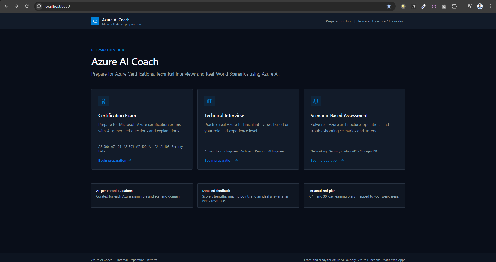
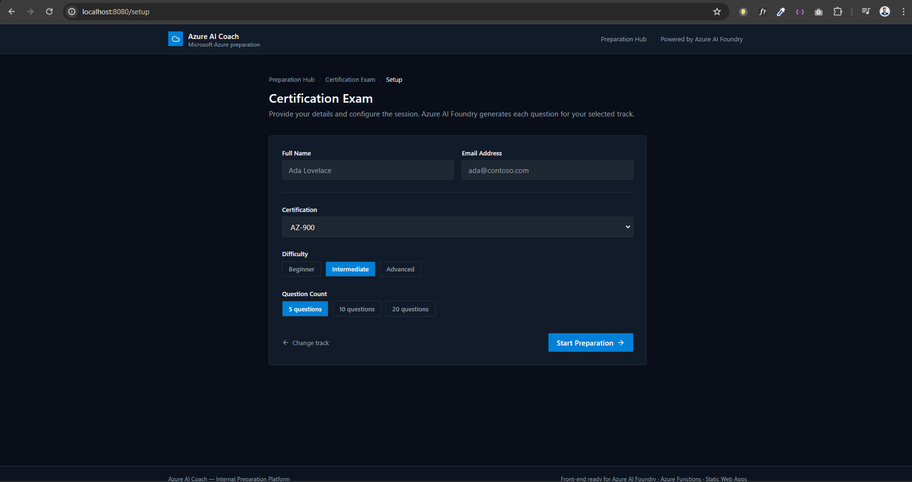
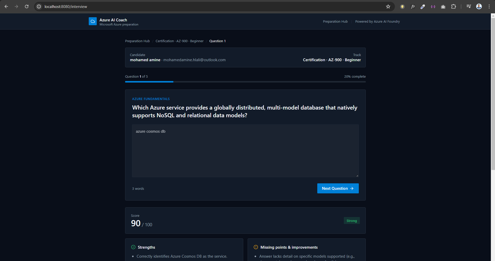
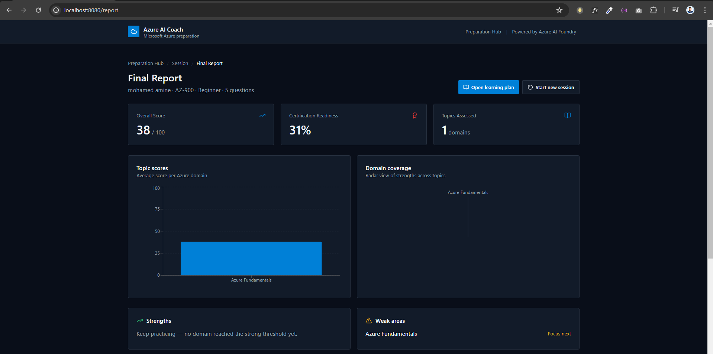
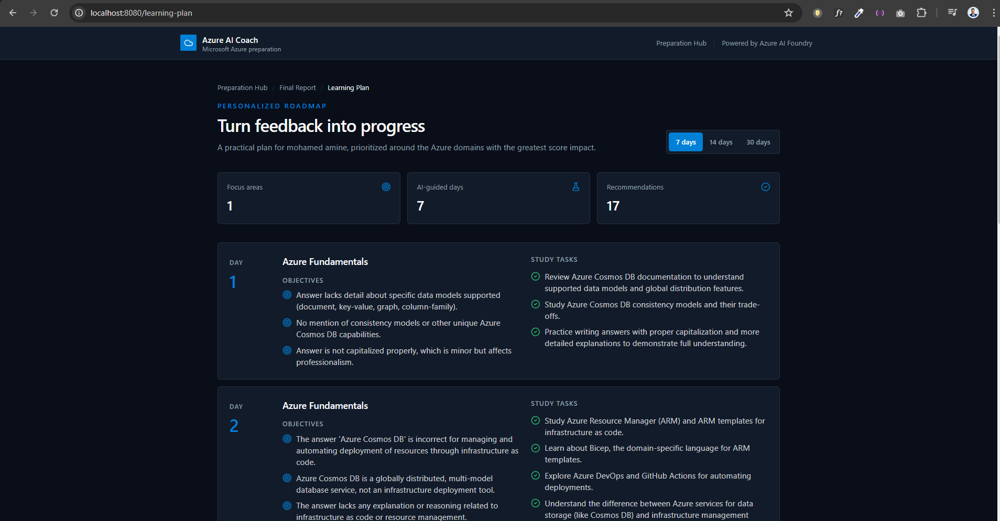
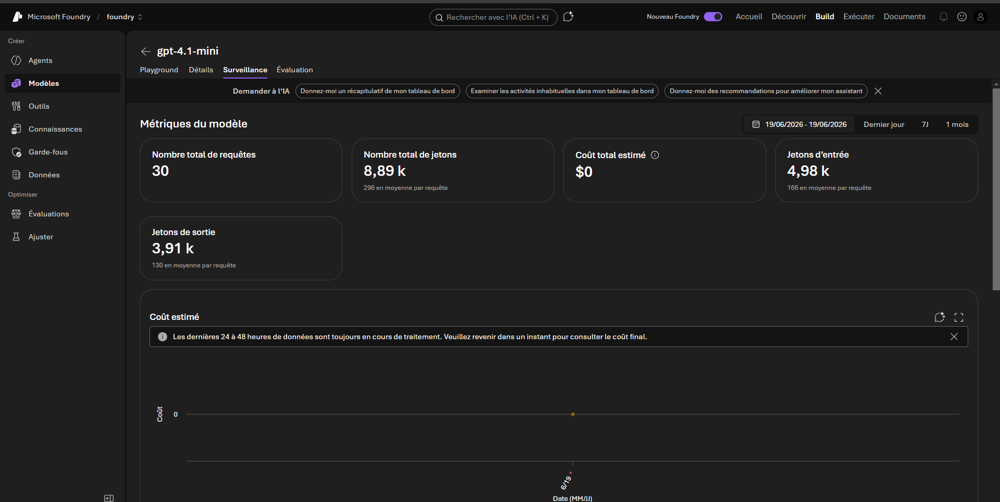
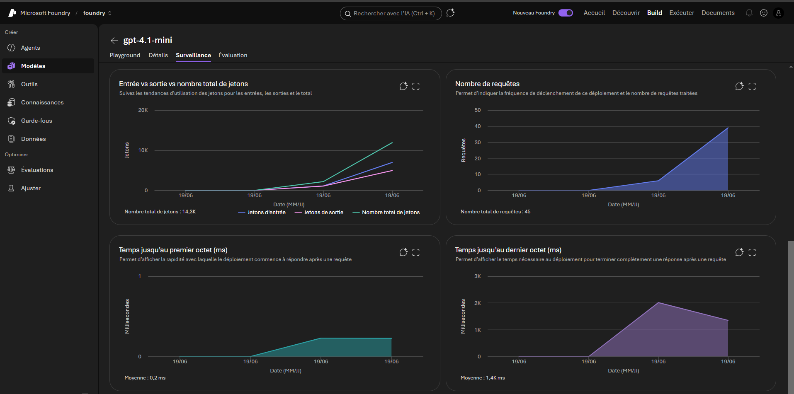
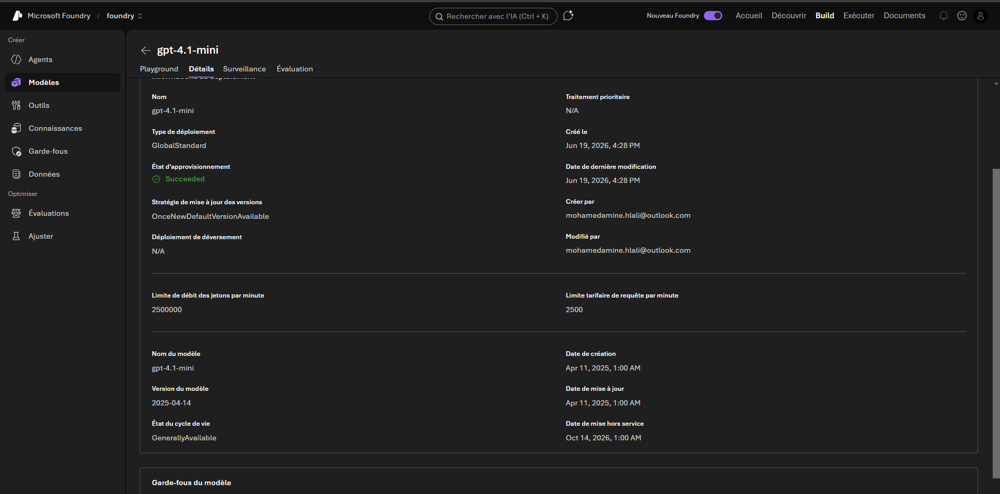

<div align="center">

# ☁️ CloudDev Interview AI

### AI-Powered Interview & Certification Preparation Platform for Cloud, DevOps & Azure Professionals

[](https://react.dev)
[](https://www.typescriptlang.org/)
[](https://azure.microsoft.com/products/functions)
[](https://ai.azure.com)
[](#license)

**Practice real Azure certification exams, technical interviews, and architecture scenarios — graded instantly by AI, with a personalized roadmap to close every skill gap.**

[Key Features](#-key-features) •
[Screenshots](#-screenshots) •
[Architecture](#-architecture) •
[Tech Stack](#-technologies-used) •
[Getting Started](#-getting-started) •
[Use Cases](#-use-cases)

</div>

---

## 📖 About The Project

**CloudDev Interview AI** (internally branded *Azure AI Coach*) is an AI-powered platform designed to help Cloud, DevOps, and Azure professionals prepare for technical interviews through interactive assessments, personalized learning plans, and AI-driven feedback.

Instead of static question banks, every question is generated on the fly by **Azure AI Foundry**, every answer is evaluated in real time with a detailed score and rationale, and every session ends with a personalized, AI-curated study roadmap mapped directly to the candidate's weak areas.

---

## ✨ Key Features

| Feature | Description |
|---|---|
| 🧠 **AI-Generated Questions** | Dynamic, role- and exam-specific questions for Azure, Cloud, DevOps, Kubernetes, Terraform, and Architecture topics — no two sessions are identical. |
| ✅ **Automated Answer Evaluation** | Every free-text answer is scored out of 100 by Azure AI Foundry, with strengths and missing points highlighted instantly. |
| 🗺️ **Personalized Certification Roadmaps** | 7 / 14 / 30-day AI-guided learning plans, prioritized around the domains with the greatest score impact. |
| 📊 **Interactive Dashboard** | Visual progress tracking with topic scores, domain coverage radar, certification readiness %, and identified strengths/weak areas. |
| 🎯 **Three Preparation Modes** | Certification Exam practice, Technical Interview simulation, and Scenario-Based architecture/operations assessments. |
| 📱 **Modern Responsive UI** | A polished, dark-themed interface built for both desktop and mobile, optimized for focused study sessions. |

---

## 🖼️ Screenshots

### 1. Preparation Hub
The landing page where candidates choose their preparation track: **Certification Exam**, **Technical Interview**, or **Scenario-Based Assessment**.



### 2. Certification Exam Setup
Candidates configure their session — certification track (AZ-900, AZ-104, AZ-305, AZ-400, AI-102, AI-103, Security, Data...), difficulty level, and question count.



### 3. AI-Powered Live Evaluation
Each answer is graded instantly by Azure AI Foundry, returning a numeric score along with a breakdown of strengths and missing points.



### 4. Final Report
A consolidated session report showing the overall score, certification readiness percentage, topic scores chart, domain coverage radar, strengths, and weak areas.



### 5. Personalized Learning Plan
An AI-generated, day-by-day roadmap (7 / 14 / 30 days) with specific study tasks mapped to each weak area identified during the assessment.




### 6. Azure AI Foundry — Model Monitoring
Behind the scenes, the underlying `gpt-4.1-mini` deployment on Azure AI Foundry is fully monitored: total requests, token usage, and estimated cost.



### 7. Azure AI Foundry — Usage Analytics
Detailed analytics on input/output token trends, request volume, and latency (time to first byte / time to last byte) for the deployed model.



### 8. Azure AI Foundry — Deployment Details
Full visibility into the model deployment configuration: deployment type, provisioning state, rate limits, model version, and lifecycle status.



---

## 🏗️ Architecture

The application follows a modern, cloud-native, serverless architecture:

```
┌─────────────────────┐      ┌──────────────────────┐      ┌──────────────────────┐
│   React / TanStack   │ ───▶ │   Azure Functions     │ ───▶ │   Azure AI Foundry    │
│   Frontend (Vite)    │      │   REST API Layer      │      │   (Azure OpenAI)      │
└─────────────────────┘      └──────────────────────┘      └──────────────────────┘
          ▲                              │                              │
          │                              ▼                              ▼
          │                  ┌──────────────────────┐      ┌──────────────────────┐
          └───────────────── │  AI Evaluation &       │ ◀── │  Prompt Engineering /  │
            Real-time score, │  Recommendation Engine │      │  Question Generation   │
            feedback & plan  └──────────────────────┘      └──────────────────────┘
```

1. The **React/TanStack frontend** delivers the candidate experience — exam setup, live Q&A, and reporting.
2. **Azure Functions** expose stateless REST APIs that orchestrate sessions and persist results.
3. **Azure AI Foundry** generates exam-specific questions and evaluates free-text answers in real time.
4. AI-generated feedback (score, strengths, missing points) is streamed back to the user instantly.
5. A **personalized learning plan** is synthesized from the aggregated session results and weak areas.

---

## 🛠️ Technologies Used

### Frontend
- React 19
- TypeScript
- TanStack Start
- TanStack Router
- React Query
- Tailwind CSS
- Radix UI Components
- Vite

### Backend
- Azure Functions
- Node.js
- REST APIs

### Artificial Intelligence
- Azure AI Foundry
- Azure OpenAI Models (`gpt-4.1-mini`)
- Prompt Engineering

### Development & Deployment
- GitHub
- GitHub Actions
- Vercel
- Azure Cloud

---

## 🎓 Use Cases

- Azure certification preparation (**AZ-104**, **AZ-305**, **AZ-400**, **AI-102**, **AI-103**, and more)
- DevOps interview practice
- Cloud Architecture interview preparation
- Kubernetes and Terraform skill assessment
- Personalized, AI-guided learning path generation

---

## 🚀 Getting Started

> Replace the placeholders below with your project's actual setup instructions once finalized.

### Prerequisites
- Node.js 18+
- An Azure subscription with access to **Azure AI Foundry**
- Azure Functions Core Tools (for local backend development)

### Installation

```bash
# Clone the repository
git clone https://github.com/<your-username>/clouddev-interview-ai.git
cd clouddev-interview-ai

# Install dependencies
npm install

# Configure environment variables
cp .env.example .env
# Fill in your Azure AI Foundry endpoint, API key, and deployment name

# Run the development server
npm run dev
```

The app will be available at `http://localhost:8080`.

---

## 🤝 Contributing

Contributions, issues, and feature requests are welcome! Feel free to check the [issues page](../../issues) or open a pull request.

1. Fork the project
2. Create your feature branch (`git checkout -b feature/amazing-feature`)
3. Commit your changes (`git commit -m 'Add some amazing feature'`)
4. Push to the branch (`git push origin feature/amazing-feature`)
5. Open a Pull Request

---

## 📄 License

This project is licensed under the **MIT License** — see the [LICENSE](LICENSE) file for details.

---

<div align="center">

**Built with ❤️ for the Azure & DevOps community**

**Powered by Hlali Mohamed Amine**

</div>
